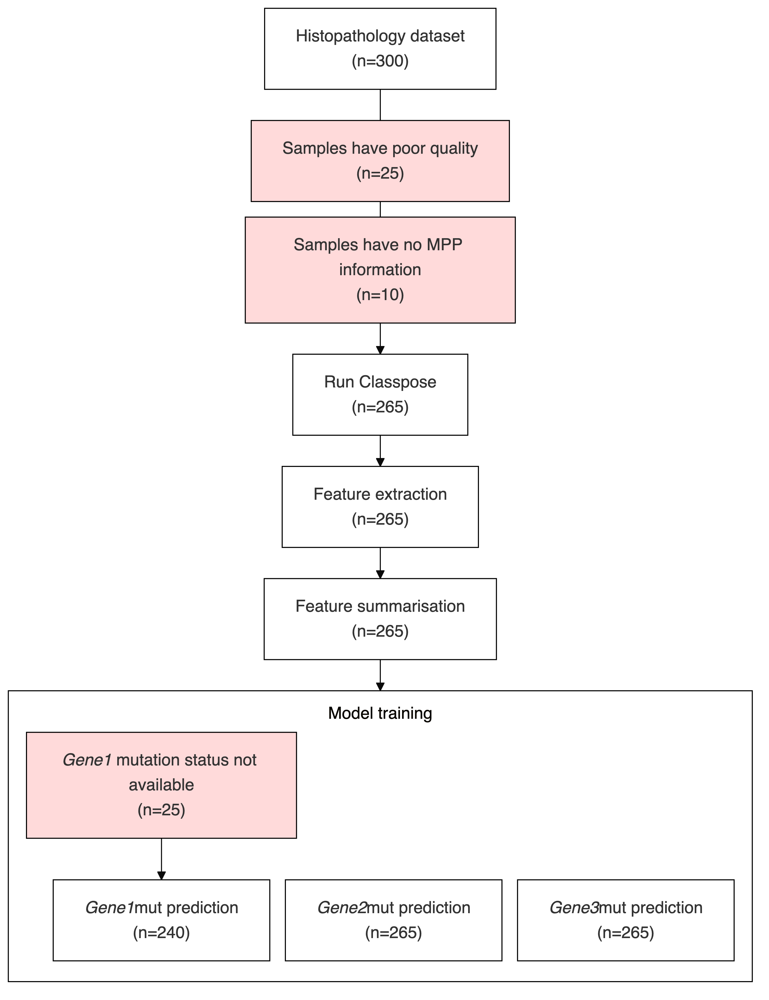

# Automatic CONSORT chart generation from YAML

Generate CONSORT-style flowcharts as [Mermaid](https://mermaid.js.org/) diagrams from YAML definitions.

## Installation

```bash
uv add consort-yaml
```

## CLI usage

```bash
uv run consort-yaml my_chart.yaml > chart.mermaid
mmdc -i chart.mermaid -o chart.svg
```

Or as a one liner:

```bash
uv run consort-yaml my_chart.yaml > chart.mermaid && mmdc -i chart.mermaid -o chart.svg
```

## Python API

```python
from consort_yaml import FlowchartBuilder, load_yaml

data = load_yaml("my_chart.yaml")
builder = FlowchartBuilder()
mermaid_str = builder.build(data)
print(mermaid_str)
```

## YAML format

A flowchart is defined by a top-level `n` (initial sample count) and a list of `steps`:

```yaml
---
n: 611
steps:
  - name: "Cohort"
  - name: "Processing"
    exclusions:
      - reason: "Failed QC"
        n: 5
  - name: "Analysis"
```

### Steps

Each step is a dict with the following keys:

- **`name`** (str, required): The label displayed in the flowchart node.
- **`exclusions`** (list, optional): A list of exclusion dicts, each with:
  - **`reason`** (str): The exclusion reason.
  - **`n`** (int): The number of samples excluded.
- **`subgraph`** (dict, optional): Renders the step as a subgraph containing
  nested steps. Contains:
  - **`direction`** (str, optional): Layout direction (`TD`, `LR`, `TB`, `RL`).
    Defaults to `TD`.
  - **`steps`** (list): Sub-steps (same structure as top-level steps).
- **`link`** (str, optional): Controls how the step connects to the previous
  step. Defaults to `"default"` (standard arrow). Special values:
  - `"none"`: The step is not connected to the previous step. Its `n` is
    computed from its own exclusions, but the running `n` is not decremented
    for subsequent steps.
  - Any other string (e.g. `"---"`): Used as the arrow style.

### Example with subgraphs and `link: none`

```yaml
---
n: 300
steps:
  - name: "Analysis"
    subgraph:
      direction: TB
      steps:
        - name: "Gene1 prediction"
          link: none
          exclusions:
            - reason: "No mutation status"
              n: 60
        - name: "Gene2 prediction"
          link: none
          exclusions:
            - reason: "No mutation status"
              n: 60
```

In this example, both "Gene1 prediction" and "Gene2 prediction" start from `n=300`
and subtract their own exclusions independently, because `link: none` prevents
the exclusions from affecting the running sample count.

### Real example

Using the YAML file in `example` (`example/example-consort.yaml`):

```yaml
---
n: 300
steps:
  - name: "Histopathology dataset"
  - name: "Run Classpose"
    exclusions:
    - reason: Samples have poor quality
      n: 25
    - reason: Samples have no MPP information
      n: 10
  - name: "Feature extraction"
  - name: "Feature summarisation"
  - name: "Model training"
    subgraph:
      direction: TB
      steps:
        - name: "<i>Gene1</i>mut prediction"
          link: none
          exclusions:
            - reason: <i>Gene1</i> mutation status not available
              n: 25
        - name: "<i>Gene2</i>mut prediction"
          link: none
        - name: "<i>Gene3</i>mut prediction"
          link: none
```

We can run `uv run consort-yaml example/example-consort.yaml > example/example-consort.mmd` to get the Mermaid diagram as output:

```
---
config:
    theme: base
    themeVariables:
        fontFamily: helvetica
    flowchart:
        rankSpacing: 15
        nodeSpacing: 15
        subGraphTitleMargin:
            top: 10
            bottom: 10
            left: 0
            right: 0
---
flowchart TD
    classDef exclusion fill:#ffdada,stroke-width:1,stroke:black
    classDef step fill:white,stroke-width:1,stroke:black
    classDef sg fill:transparent,stroke-width:1,stroke:black


    step0["Histopathology dataset<br>(n=300)"]
    exclusion0["Samples have poor quality<br>(n=25)"]
    exclusion1["Samples have no MPP information<br>(n=10)"]
    step1["Run Classpose<br>(n=265)"]
    step2["Feature extraction<br>(n=265)"]
    step3["Feature summarisation<br>(n=265)"]
    subgraph sg0 [Model training]
        direction TB
        exclusion2["<i>Gene1</i> mutation status not available<br>(n=25)"]
        step4["<i>Gene1</i>mut prediction<br>(n=240)"]
        exclusion2 --> step4
        step5["<i>Gene2</i>mut prediction<br>(n=265)"]
        step6["<i>Gene3</i>mut prediction<br>(n=265)"]
    end
    step0 ---- exclusion0 --- exclusion1 ---> step1 ---> step2 ---> step3 ---> sg0
    class step0,step1,step2,step3,step4,step5,step6 step
    class exclusion0,exclusion1,exclusion2 exclusion
    class sg0 sg
```

And then convert this to PNG using `mmdc -i example/example-consort.mmd -o example/example-consort.png -s 4`:



Running everything as a single line:

```bash
uv run consort-yaml example/example-consort.yaml > example/example-consort.mmd && mmdc -i example/example-consort.mmd -o example/example-consort.png -s 4
```
